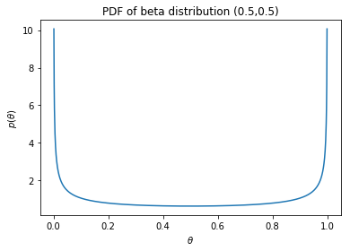
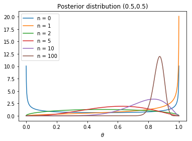

## EECS 491 Assignment 1
Yue Shu

# Q1. Basic Probability

## 1.1 
**Prove
\begin{equation}
p(x,y|z) = p(x|z)p(y|x,z)
\end{equation}**

*Proof:* 
$$ p(x,y|z) = \frac{p(x,y,z)}{p(z)} $$
$$ p(x,y,z) = p(y|x,z)p(x,z) $$
$$ p(x,y|z) = \frac{p(y|x,z)p(x,z)}{p(z)} $$
$$ \frac{p(x,z)}{p(z)} = p(x|z) $$
$$ p(x,y|z) = p(y|x,z)p(x|z) $$
Therefore, 
\begin{equation}
p(x,y|z) = p(x|z)p(y|x,z)
\end{equation}

## 1.2 
**Prove**  
\begin{equation}
p(x|y,z) = \frac{p(y|x,z)p(x|z)}{p(y|z)}
\end{equation}

*Proof:* 
$$ p(x|y,z) = \frac{p(x,y,z)}{p(y,z)} $$
$$ p(x,y,z) = p(y|x,z)p(x,z) $$
$$ p(x|y,z) = \frac{p(y|x,z)p(x,z)}{p(y,z)} $$
$$ p(x,z) = p(x|z)p(z) $$
$$ p(y,z) = p(y|z)p(z) $$
Therefore, 
$$ p(x|y,z) = \frac{p(y|x,z)p(x|z)p(z)}{p(y|z)p(z)} = \frac{p(y|x,z)p(x|z)}{p(y|z)}$$

# Q2. Independence

## 2.1 
**Show that independence is not transitive, i.e. 
$a ⫫ b ∧ b ⫫ c ⇏ a ⫫ c$. Define a joint probability distribution $p(a,b,c)$ for which the previous expression holds and provide an interpretation.**

*Proof:* 

  Let's define a probability distribution set as follow: $p(a) = 0.4$, $p(b) = 0.8$, $p(c) = 0.3$,  
  while $p(a ∧ b) = 0.32$, $p(b ∧ c) = 0.24$, $p(a ∧ c) = 0.1$, $p(a ∧ b ∧ c) = 0.12$.

According to the definition of proposition independence, $x$ and $y$ are independent if and only if $p(x ∧ y) = p(x) * p(y)$.

Therefore, by the defined joint probability distribution, $a ⫫ b ∧ b ⫫ c$ since $p(a ∧ b) = 0.32 = p(a) * p(b)$ and $p(b ∧ c) = 0.24 = p(b) * p(c)$, whereas $a \not\!\perp\!\!\!\perp c$ since $p(a ∧ c) = 0.1 \neq p(a) * p(c) = 0.12$.

Finally, we can also see that  $p(a ∧ b ∧ c) = 0.12 \neq p(a) * p(b) * p(c) = 0.96$, which further proves that this is not an independent set.

Therefore, we may conclude that independence is not transitive, i.e. $a ⫫ b ∧ b ⫫ c ⇏ a ⫫ c$.

## 2.2
**Show that conditional independence does not imply marginal independence, i.e. $a ⫫ b | c ⇏ a ⫫ b$. Again provide an example.**

*Proof:* 

  Let's define a conditional probability distribution set as follow: $p(a) = 0.4$, $p(b) = 0.8$, $p(a ∧ b) = 0.28$.  
  Also, $p(a|c) = 0.5$, $p(b|c) = 0.6$, $p(a ∧ b|c) = 0.3$.
  
By definition of conditional independence, $a ⫫ b | c ⇔ (a | c) ⫫ (b | c) ⇔ p(a|c) * p(b|c) = p(a ∧ b|c)$.

Therefore, by the defined conditional probability distribution, $a ⫫ b | c$ since $p(a|c) * p(b|c) = 0.3 = p(a ∧ b|c)$.

However, $a \not\!\perp\!\!\!\perp b$ since $p(a ∧ b) = 0.28 \neq p(a) * p(b) = 0.32$.

Therefore, we shall conclude that conditional independence does not imply marginal independence, i.e. $a ⫫ b | c ⇏ a ⫫ b$.

# Q3. Inspector Clouseau re-revisited

## 3.1

**Write a program to evaluate $p(B|K)$ in Example 1.3 in Barber. Write your code and choose your data representations so that it is easy to use it to solve the remaining questions. Show that it correctly computes the value in the example.** 

Let's first define the variables we will be using in the program to make it clear:

  `pb`: $p(B = murderer)$  
  `pm`: $p(M = murderer)$  
  `pKBM`: $p(K,B,M)$  
  `pnm`: $p(M = not~murderer)$  
  And for conditional probabilities, `_` in a variable is equivalent to `|`, for example, `pa_b` means $p(a|b)$, `pab_c` means $p(a,b|c)$.  


```python
pb = 0.6
pm = 0.2
pk_nbnm = 0.3
pk_nbm = 0.2
pk_bnm = 0.6
pk_bm = 0.1
## Calculating the value of p(B|K) according to equation 1.2.7 in Example 1.3 in Barber
def __pB_K__(pB, pk_Bm, pk_Bnm):
    pB_K = (pB * (pk_Bm * pm + pk_Bnm * (1 - pm))) / (pb * (pk_bm * pm + pk_bnm * (1 - pm)) + 
                                                      (1 - pb) * (pk_nbm * pm + pk_nbnm * (1 - pm)))
    return pB_K
## The value of p(B = murderer|K)
pb_k = __pB_K__(pb, pk_bm, pk_bnm)
## The value of p(B = not murderer|K)
pnb_k = __pB_K__(1 - pb, pk_nbm, pk_nbnm)
print("The answer to problem 3.1, p(B|K) = <" + str(pb_k) + ", " + str(pnb_k) + ">.")
```

  According to equation 1.2.8 in Example 1.3, the result of $p(B = murderer|knife~used)$ is rounded to 0.73, which conforms with the answer we just got above. Also, the normalized results of $p(b|K)$ and $p(\neg b|K)$ sum to 1 correctly.  
  Therefore, my function correctly computes the value in the example.

## 3.2 

**Define a different distribution for $p(K|M,B)$.  Your new distribution should result in the outcome that $p(B|K)$ is either $<0.1$ or $>0.9$, i.e. reasonably strong evidence.  Use the original values of $p(B)$ and $p(M)$ from the example.  Provide (invent) a reasonble justification for the value of each entry in $p(K|M,B)$.** 

  Let's suppose that we have reasonably strong evidence implying the guilty of the Butler.  
  To make that happen, we need to ensure that the Butler is more likely to use knife as a murder weapon rather than the Maid.
  
  `pk_nbnm = 0.05`: it is very unlikely that the knife is used by someone else other than the two suspects we have since this is a locked room murder and the murderer cannot escape!  
  `pk_nbm = 0.2`: it is less likely that the Maid would use the knife as a murder weapon since she might be too weak to stab the knife into the victim.  
  `pk_bnm = 0.75`: it is very likely that the strong merciless Butler would use the knife as a murder weapon.  
  `pk_bm = 0.3`: it is possible that the two conspiracies would use the knife as murder weapon together.
  
Now that we have the values, let's plug them in and see the outcome: 


```python
pk_nbnm = 0.05
pk_nbm = 0.2
pk_bnm = 0.75
pk_bm = 0.3
## The value of p(B = murderer|K)
pb_k = __pB_K__(pb, pk_bm, pk_bnm)
## The value of p(B = not murderer|K)
pnb_k = __pB_K__(1 - pb, pk_nbm, pk_nbnm)
print("The answer to problem 3.2, p(B|K) = <" + str(pb_k) + ", " + str(pnb_k) + ">.")
```

    The answer to problem 3.2, p(B|K) = <0.9252336448598131, 0.07476635514018691>.
    

Now we have reasonably strong evidence that the Butler is the murderer, as we wish. Guess who's the dirty cop?

## 3.3

**Derive the equation for $p(M|K)$.** 

We can derive the equation for $p(M|K)$ following the equation 1.2.7 in Example 1.3 in the textbook as follow:  

$$ p(M|K) = \sum_{b} p(M,b|K) = \sum_{b} \frac{p(M,b,K)}{p(K)} = \frac{\sum_{b} p(K|M,b)p(M,b)}{\sum_{b, m} p(K|b,m)p(b,m)} $$
$$ p(M|K) = \frac{p(M)\sum_{b} p(K|M,b)p(b)}{\sum_{m} p(m) \sum_{b} p(K|b,m)p(b)} $$ 

And then we shall derive a function according to the equation above to calculate $p(M|K)$:


```python
def __pM_K__(pM, pk_bM, pk_nbM):
    pM_K = (pM * (pk_bM * pb + pk_nbM * (1 - pb))) / (pm * (pk_bm * pb + pk_nbm * (1 - pb)) + 
                                                      (1 - pm) * (pk_bnm * pb + pk_nbnm * (1 - pb)))
    return pM_K
```

## 3.4

**Calculate it's value for both the original $p(K|M,B)$ and the one you defined yourself. Is it possible to provide a summary of the main factors that contributed to the value?  Why/Why not?  Explain.** 

### Original entry
Let's first take a look at the result calculated with the original $p(K|M,B)$:


```python
## The original value set
pk_nbnm = 0.3
pk_nbm = 0.2
pk_bnm = 0.6
pk_bm = 0.1

## The value of p(M = murderer|K)
pm_k = __pM_K__(pm, pk_bm, pk_nbm)
## The value of p(M = not murderer|K)
pnm_k = __pM_K__(1 - pm, pk_bnm, pk_nbnm)

print("The answer to problem 3.4.1, p(M|K) = <" + str(pm_k) + ", " + str(pnm_k) + ">.")
```

    The answer to problem 3.4.1, p(M|K) = <0.06796116504854369, 0.9320388349514562>.
    

### Modified entry
Let's now take a look at the result calculated with my modified $p(K|M,B)$:


```python
## The modified value set
pk_nbnm = 0.05
pk_nbm = 0.2
pk_bnm = 0.75
pk_bm = 0.3

## The value of p(M = murderer|K)
pm_k = __pM_K__(pm, pk_bm, pk_nbm)
## The value of p(M = not murderer|K)
pnm_k = __pM_K__(1 - pm, pk_bnm, pk_nbnm)

print("The answer to problem 3.4.2, p(M|K) = <" + str(pm_k) + ", " + str(pnm_k) + ">.")
```

    The answer to problem 3.4.2, p(M|K) = <0.12149532710280375, 0.8785046728971962>.
    

  If we compare the two results, we shall see that the probability that the Maid was the murderer is actually higher in our modified condition!  
  Besides a slightly higher value of $p(k|b,\neg m)$ in our modified dataset, the two major differences between the originial and modified $p(K|M,B)$ is that our modified dataset has a smaller $p(k|\neg b, \neg m)$ and a larger $p(k|b,m)$.  
  Since it's not so favorable to look for main factors while there are too many variables in the dataset, I will make a few more comparisons variating one single entry from the original dataset each time. 

### Trial One: smaller  $p(k|\neg b, \neg m)$
Variating only the $p(k|\neg b, \neg m)$ to be $1/3$ of the original value slightly increases the probability of $p(m|k)$ as shown below:


```python
pk_nbnm = 0.1
pk_nbm = 0.2
pk_bnm = 0.6
pk_bm = 0.1

## The value of p(M = murderer|K)
pm_k = __pM_K__(pm, pk_bm, pk_nbm)
## The value of p(M = not murderer|K)
pnm_k = __pM_K__(1 - pm, pk_bnm, pk_nbnm)

print("The result of trial one is p(M|K) = <" + str(pm_k) + ", " + str(pnm_k) + ">.")
```

    The result of trial one is p(M|K) = <0.08045977011494251, 0.9195402298850575>.
    

### Trial Two: larger $p(k|b,\neg m)$
Increasing only the $p(k|b,\neg m)$ by $1/3$ of the original value slightly decreases the probability of $p(m|k)$ as shown below:


```python
pk_nbnm = 0.3
pk_nbm = 0.2
pk_bnm = 0.8
pk_bm = 0.1

## The value of p(M = murderer|K)
pm_k = __pM_K__(pm, pk_bm, pk_nbm)
## The value of p(M = not murderer|K)
pnm_k = __pM_K__(1 - pm, pk_bnm, pk_nbnm)

print("The result of trial two is p(M|K) = <" + str(pm_k) + ", " + str(pnm_k) + ">.")
```

    The result of trial two is p(M|K) = <0.05511811023622048, 0.9448818897637795>.
    

### Trial Three: larger $p(k|b,m)$
Increasing only the $p(k|b,m)$ by $1/3$ of the original value slightly increases the probability of $p(m|k)$ as shown below:


```python
pk_nbnm = 0.3
pk_nbm = 0.2
pk_bnm = 0.6
pk_bm = 0.13

## The value of p(M = murderer|K)
pm_k = __pM_K__(pm, pk_bm, pk_nbm)
## The value of p(M = not murderer|K)
pnm_k = __pM_K__(1 - pm, pk_bnm, pk_nbnm)

print("The result of trial three is p(M|K) = <" + str(pm_k) + ", " + str(pnm_k) + ">.")
```

    The result of trial three is p(M|K) = <0.07603464870067374, 0.9239653512993262>.
    

### Trial Four: larger $p(k|\neg b,m)$
Increasing only the $p(k|\neg b,m)$ by $1/3$ of the original value slightly increases the probability of $p(m|k)$ as shown below:


```python
pk_nbnm = 0.3
pk_nbm = 0.26
pk_bnm = 0.6
pk_bm = 0.1

## The value of p(M = murderer|K)
pm_k = __pM_K__(pm, pk_bm, pk_nbm)
## The value of p(M = not murderer|K)
pnm_k = __pM_K__(1 - pm, pk_bnm, pk_nbnm)

print("The result of trial four is p(M|K) = <" + str(pm_k) + ", " + str(pnm_k) + ">.")
```

    The result of trial four is p(M|K) = <0.07869481765834933, 0.9213051823416507>.
    

### Conclusion
  As we can see from the four trials above, variating the entries of $p(K|B,M)$ by $1/3$ contributes to the same extent of variance to the fianl result we get. Therefore, all four are the factors that contributed to the value, or in other words, none of the entires is the main factor that affects the value.  
  In fact, $p(M)$ is the main factor to the value as we also can conclude from the equation we derived from part 3.3. 

# Q4. Biased views

## 4.1
**Write a program that calculates the posterior distribution of the $\theta$ (probability of heads) from the Binomial distribution given $y$ heads out of $n$ trials.  Feel free to use a package where the necessary distributions are defined as primitives.**

First of all let's derive all the equations and expressions we need:

  The `likelihood` (probability of getting $y$ heads out of n trials with a heads probability of $\theta $):
  $$ p(y | \theta, n) = {n \choose y} \theta^y (1 - \theta)^{n-y}$$
  The `prior` (what is our "view" on the coin bias):
  $$ p(\theta|n) $$ 
  The `normalizing constant`:
  $$ p(y|n) = \int_{0}^1 p(y|\theta,n)p(\theta|n)d\theta = \frac{1}{n + 1}$$
  And then we shall come up with the equation of the `posterior distribution` of $\theta$ given uninformative prior:
  $$ p(\theta|y,n) = {n \choose y} \theta^y (1 - \theta)^{n - y}(n + 1) $$
  
Now we shall derive a function of the posterior distribution according to the equation we just had:


```python
import numpy as np
import scipy.stats
from scipy.stats import binom

def __posterior__ (y, n, theta, prior):
    likelihood = binom.pmf(y, n, theta)
    posterior = likelihood * (n + 1) * prior
    return posterior
```

## 4.2
**Imagine three different views on the coin bias:**
- **"I believe strongly that the coin is biased to either mostly heads or mostly tails."**
- **"I believe strongly that the coin is unbiased".**
- **"I don't know anything about the bias of the coin."**

**Define and plot prior distributions that expresses each of these beliefs.  Provide a brief explanation.**

### Strong belief that the coin is biased
  We know that our coin is very biased in one way or the other, although we have no idea in which way yet.  
  In this case, we shall need a beta function with the shape of its graph similar to a "U". A Jeffreys prior may be a good example, where $\alpha = 0.5,~\beta = 0.5$.
  
Now let's plot the PDF of our beta distribution!


```python
import matplotlib.pyplot as plt
import matplotlib as mpl

def __prior__(alpha, beta):
    x = np.linspace(0, 1, 1000)
    y = scipy.stats.beta(alpha, beta).pdf(x)
    fig, ax = plt.subplots()
    ax.plot(x, y)
    ax.set_xlabel(r"$\theta$")
    ax.set_ylabel(r"$p(\theta)$")
    ax.set_title("PDF of beta distribution ({},{})".format(alpha,beta))
    
__prior__(0.5, 0.5)
```





From the graph above, we shall see very high probability distribution on both sides of heads and tails, implying that this is a very biased coin just as how we believed. 

### Strong belief that the coin is unbaised

  In this case we have very strong belief that the coin is unbiased, probably because we have seen our friend tossing it many times, and the probability of heads converges to 0.5.  
  Anyways, we base our belief on the prior knowledge about the coin, so we should have very large values for both of the $\alpha$ and $\beta$ accordingly. Let's assume $\alpha = 100,~\beta = 100$ 
  
The PDF of our beta distribution should look like the following image:


```python
__prior__(100, 100)
```


From the graph above, we shall see the distribution centered at $\theta = 0.5$, meaning equal probability of getting heads and tails, which conforms with our belief that this is a very unbiased coin. 

### No informative knowledge about the bias of the coin

  Very sadly, in this case we have no informative prior knowledge about the prior.  
  To make sense of that, the value of our $\alpha$ and $\beta$ should represent our first trial on this coin. Therefore, we should have $\alpha = 1,~\beta = 1$  
  
Let's take a look at our PDF of beta distribution with no prior knowledge:


```python
__prior__(1, 1)
```


In this case, we shall see a flat distribution, meaning that all biases are equally likely, which conforms with the fact that we have no informative knowledge about the prior. 

## 4.3
**Perform Bernoulli trials where each one of these views is correct.  Show how the posterior distribution of $\theta$ changes for each view for $n=0, 1, 2, 5, 10, \textrm{and} 100$.  Each view should have its own plot, with the plots of the posterior after different numbers of trials overlayed.**

### Strong belief that the coin is biased
  In this case we are having a very biased coin. Since it is impossible to bias towards both heads and tails, let's suppose that this is a very "heads likely" coin. So let's say $\theta = 0.9$


```python
def __posterior_overlay__ (alpha, beta, theta):
    np.random.seed(491)
    fig, ax = plt.subplots()
    ## n = 0
    n = 0
    Y = np.random.binomial(1, theta, n)
    a1 = alpha + Y.sum()
    a2 = beta + n - Y.sum()
    x = np.linspace(0, 1, 1000)
    y = scipy.stats.beta(a1, a2).pdf(x)
    ax.plot(x, y, 'r')
    ## n = 1
    n = 1
    Y = np.random.binomial(1, theta, n)
    a1 = alpha + Y.sum()
    a2 = beta + n - Y.sum()
    x = np.linspace(0, 1, 1000)
    y = scipy.stats.beta(a1, a2).pdf(x)
    ax.plot(x, y, 'g');
    ## n = 2
    n = 2
    Y = np.random.binomial(1, theta, n)
    a1 = alpha + Y.sum()
    a2 = beta + n - Y.sum()
    x = np.linspace(0, 1, 1000)
    y = scipy.stats.beta(a1, a2).pdf(x)
    ax.plot(x, y, 'b');
    ## n = 5
    n = 5
    Y = np.random.binomial(1, theta, n)
    a1 = alpha + Y.sum()
    a2 = beta + n - Y.sum()
    x = np.linspace(0, 1, 1000)
    y = scipy.stats.beta(a1, a2).pdf(x)
    ax.plot(x, y, 'c');
    ## n = 10
    n = 10
    Y = np.random.binomial(1, theta, n)
    a1 = alpha + Y.sum()
    a2 = beta + n - Y.sum()
    x = np.linspace(0, 1, 1000)
    y = scipy.stats.beta(a1, a2).pdf(x)
    ax.plot(x, y, 'y');
    ## n = 100
    n = 100
    Y = np.random.binomial(1, theta, n)
    a1 = alpha + Y.sum()
    a2 = beta + n - Y.sum()
    x = np.linspace(0, 1, 1000)
    y = scipy.stats.beta(a1, a2).pdf(x)
    ax.plot(x, y, 'm');
    plt.ylim(0, 20)
    
    ax.set_xlabel(r"$\theta$")
    ax.set_title("Posterior distribution ({},{})".format(alpha, beta));

__posterior_overlay__(0.5, 0.5, 0.9)
```





### Strong belief that the coin is unbaised
In this case we are having a perfecly unbiased coin, which means $\theta = 0.5$


```python
__posterior_overlay__(100, 100, 0.5)
```


### No informative knowledge about the bias of the coin
  In this case we have no prior knowledge about the bias of the coin, so whatever value for $\theta$ should be fine.  
  Let's just suppose that this is still a perfectly unbiased coin, which means $\theta = 0.5$.


```python
__posterior_overlay__(1, 1, 0.5)
```


## 4.4
**Is it possible that each view will always arrive at an accurate estimate of $\theta$?  How might you determine which view is most consistent with the data after $n$ trials?**


  In the previous part we went through the cases where each view is correct. In order to determine whether each view will always arrive at an accurate estimate of $\theta$, and which view is the most consistent one, let's perform a few more experiments on the three views together.  
  Let's have four different coins, with different $\theta$ values respectively: $0.2, 0.4, 0.6, 0.8$  
  To make this a fair game, none of the views makes "perfect" guess on the bias of the coin.  
  Also, to make our conclusion more accurate, let's perform 1000 trials on each coin.


```python
def __experiment__ (theta):
    np.random.seed(491)
    fig, ax = plt.subplots()
    ## very biased
    n = 1000
    alpha = 0.5
    beta = 0.5
    Y = np.random.binomial(1, theta, n)
    a1 = alpha + Y.sum()
    a2 = beta + n - Y.sum()
    x = np.linspace(0, 1, 1000)
    y = scipy.stats.beta(a1, a2).pdf(x)
    ax.plot(x, y, 'r')
    ## unbiased
    alpha = 100
    beta = 100
    a1 = alpha + Y.sum()
    a2 = beta + n - Y.sum()
    x = np.linspace(0, 1, 1000)
    y = scipy.stats.beta(a1, a2).pdf(x)
    ax.plot(x, y, 'g')
    ## uninformative knowledge about prior
    alpha = 1
    beta = 1
    a1 = alpha + Y.sum()
    a2 = beta + n - Y.sum()
    x = np.linspace(0, 1, 1000)
    y = scipy.stats.beta(a1, a2).pdf(x)
    ax.plot(x, y, 'b')
    
    ax.set_xlabel(r"$\theta$")
    ax.set_title("Posterior distribution theta = {}".format(theta));

__experiment__(0.2)
__experiment__(0.4)
__experiment__(0.6)
__experiment__(0.8)
```


According to the plots above, we shall see that the biased view and the uninformative view always conforms with each other, and they are always more consistent with the data after $1000$ trials. If we decrease both the $\alpha$ and $\beta$ parameters in the unbiased view, it can also arrive at the same accurate estimate as shown below. However, in that case the belief that the coin is unbiased would not be strong enough :P. 

Therefore, we can conclude that it is not possible that each view will always arrive at an accurate estimate of $\theta$: the unbiased view would always fail. 

# Q5. Inference using the Poisson distribution
**Suppose you are observing a series of events that occur at the following times (in seconds): 0.53, 0.65, 0.91, 1.19, 1.30, 1.33, 1.90, 2.01, 2.48.**

## 5.1
**Model the rate at which the events are produced using a Poisson distribution where $\lambda$ is the number of events $n$ observed per unit time (1 second).  Show the likelihood equation and plot it for three different values of $\lambda$: less, about equal, and greater than what you estimate (intuitively) from the data.**

  According to the data above, my estimation on $\lambda$ is $\lambda = 3.5$  
  The likelihood equation would be 
  $$ L(\lambda;x_{1},...,x_{n}) = \prod_{j = 1}^n exp(-\lambda)\frac{1}{x_{j}!}{\lambda}^{x_{j}} $$
  To better understand the equation, let's step a bit further with parameters provided in part 5.2 to make our life easier:  
  $$ p(n,T|\lambda) = \frac {exp(-\lambda T)(\lambda T)^{n}}{n!} $$


```python
from scipy.stats import poisson

def __likelihood__ (lamb, n, T):
    x = np.arange(0, n)
    y = poisson.pmf(x, lamb * T)
    plt.plot(x, y, label = 'Lambda = {}'.format(lamb))
    plt.title('Likelihood of Poisson distribution')
    plt.xlabel("number of observavions")
    plt.ylabel("probability")
    plt.legend()

__likelihood__(1, 9, 2.5)
__likelihood__(3.5, 9, 2.5)
__likelihood__(6, 9, 2.5)
```


## 5.2
**Derive the posterior distribution of $\lambda$ assuming a Gamma prior (usually defined with parameters $\alpha$ and $\beta$).  The posterior should have the form $p(\lambda | n, T, \alpha, \beta)$ where $T$ is the total duration of the observation period and $n$ is the number of events observed within that period.**

  We shall first derive a general form of the posterior distribution with likelihood and prior as below:  
  $$ p(\lambda |n,T,\alpha,\beta) \propto p(n,T|\lambda)p(\lambda|\alpha,\beta) $$
  We already know about the `likelihood`:  
  $$ p(n,T|\lambda) = \frac {exp(-\lambda T)(\lambda T)^{n}}{n!} $$
  We are assuming a `Gamma prior` in this part, which can be expressed as:
  $$ p(\lambda |\alpha,\beta) = \frac {\beta ^ {\alpha}}{\Gamma (\alpha)} \lambda ^{\alpha - 1}exp(-\beta \lambda) $$
  Given the combinition of above equations, we can derive the final expression of the posterior distribution of $\lambda$ as below:
  $$ p(\lambda |n,T,\alpha,\beta) \propto \frac {exp(-\lambda T)(\lambda T)^{n}}{n!} \frac {\beta ^ {\alpha}}{\Gamma (\alpha)} \lambda ^{\alpha - 1}exp(-\beta \lambda) $$

## 5.3
**Show that the Gamma distribution is a *conjugate prior* for the Poisson distribution, i.e. it is also a Gamma distribution, but defined by parameters $\alpha'$ and $\beta'$ that are functions of the prior and likelihood parameters.**

  In the previous part, we have derived a posterior distribution equation assuming a Gamma prior for the Poisson distribution.  
  We can easily conjugate the expression to what we want in this part as below:
  $$ p(\lambda |n,T,\alpha,\beta) \propto \frac {exp(-\lambda T)(\lambda T)^{n}}{n!} \frac {\beta ^ {\alpha}}{\Gamma (\alpha)} \lambda ^{\alpha - 1}exp(-\beta \lambda) $$
  $$ p(\lambda |n,T,\alpha,\beta) \propto \frac {T^{n}}{n!} \frac {\beta ^ {\alpha}}{\Gamma (\alpha)} \lambda ^{\alpha - 1 + n}exp(-\beta \lambda - T \lambda) $$
   $$ p(\lambda |n,T,\alpha,\beta) \propto \frac {T^{n}}{n!} \frac {\beta ^ {\alpha}}{\Gamma (\alpha)} \lambda ^{\alpha + n - 1}exp(-(\beta + T) \lambda) $$
   Ignoring the left hand side of the expression, we can see that the right hand part $\lambda ^{\alpha + n - 1}exp(-(\beta + T) \lambda)$ seems very familiar to us!  
   Let $\alpha' = \alpha + n$, $\beta' = \beta + T$, and we shall have our conjugation ready:  
   $$ p(\lambda |n,T,\alpha,\beta) = Gamma(\lambda, \alpha', \beta') $$

## 5.4
**Plot the posterior distribution for the data above at times $T$ = 0, 0.5, and 1.5.  Overlay the curves on a single plot.  Comment how it is possible for your beliefs to change even though no new events have been observed.**

  Although we have been talking about the gamma prior quite a lot, we haven't chosen the parameters yet.  
  For simplicity, I will just make a pretty standard choice of $\alpha = 9$, $\beta = 3$. 


```python
from scipy.stats import gamma

def __posterior__ (n, T, alpha, beta):
    x = np.linspace (0, 10, 1000) 
    ## The third parameter is the scale parameter theta, theta = 1 / beta 
    y = gamma.pdf(x, alpha + n, scale = 1 / (beta + T))
    plt.plot(x, y, label = 'T = {}'.format(T))
    plt.title('Posterior Distribution')
    plt.xlabel("lambda")
    plt.ylabel("probability")
    plt.legend()

__posterior__(9, 0, 9, 3)
__posterior__(9, 0.5, 9, 3)
__posterior__(9, 1.5, 9, 3)
```


  Although we change the $\beta$ parameter with respect to $T$ over time as above, there is actaully no informative knowledge about when will the next event be observed, and the change of $T$ only represents the change of our observation time interval.  
  The change of posterior is resulted from the change of prior, which in this case is the Gamma prior parametrized by $\alpha$ and $\beta$. As we have discussed in the previous parts, the Gamma distribution is a conjugate prior of Poisson distribution, which means that our conjugated $\beta$ value contributes to the `rate` parameter of our new Gamma distribution. Since the $\beta'$ we obtain from the equations above is defined by the old $\beta$ and $T$, we can see how the posterior changes over time without observation on new events.  
  To make better sense of that, imagine you're watching an arbitrary series of events within a time interval, your belief on the frequency of events is always updated no matter there are new events are not: seeing no event happens changes your belief negatively.  
  Therefore it is very common to see the posterior changes over time even without new events being observed.

# Q6. Exploration

## 6.1
**Discrete inference problem**

  In the Inspector Clouseau problem from Q3 we tried out discrete inference with three major variables `Maid`, `Knife`, and `Butler`.  
  In this problem, I'd like to practice discrete inference with more complex variables which will require higher level of variable elimination skills. Lukilly, I took EECS391 with Prof. Lewicki, which allows me to do some basic variable reductions. Let's take a look at the problem first:
  
  Huhu is a 2-year-old cat I raise in my apartment. A typical day of Huhu is sleeping, eating, and then sleeping again.  
  However, there was one day I got home and noticed that the door of my bedroom was open. Furthermore, Huhu did not greet me as I entered my apartment, whereas he has been doing so for the past 8 months. Only when Huhu knows he has done something I dislike while I'm not home will he hide somewhere when I come back. The door of my apartment was locked, so it was very unlikely that a burgerer broke in.  

For me, there are two possibilities:  
  1. My roommate Bi entered my bedroom when I wasn't home to borrow my iPad as usual. She forgot to close the door when she left. There are evidence supporting this guess since my iPad wasn't on my desk. I'd love to ask my roommate if it was she leaving the door open, but she wasn't home by that time. 
  2. Huhu opened the door when I was away. Knowing that I would noticed him breaking out seeing the opened bedroom door, he hid somewhere. Trust me, I've seen him doing so.  

Now that we have setup the scenario, let's name all the variables we have:  
- `O`: the open door. Let $p(o)$ denote $p(Open~Door~=~True)$.
- `H`: Huhu opened the door. Let $p(h)$ denote $p(Huhu~Opened~Door~=~True)$.
- `B`: Bi entered my room. Let $p(f)$ denote $p(Bi~Entered~Room~=~True)$.
- `P`: my iPad. Let $p(p)$ denote $p(My~iPad~Was~Borrowed~=~True)$.
- `S`: Huhu was scared at me. Let $p(s)$ denote $p(Huhu~Scared~at~Me~=~True)$.  

To make the conditional relashionships more obvious, let me draw a graph with linked nodes:  
`[iPad]` <-- `[Bi entered]` --> `[open door]` <-- `[Huhu opened]` --> `[scared cat]`

Also I'll provide a full set of conditional probabilites in order for me to compute the posteriors: 

| $~$  | $p(B)$ |
| :--- | :----- |
| T    | 0.3    |
| F    | 0.7    |

| $~$  | $p(H)$ |
| :--- | :----- |
| T    | 0.15   |
| F    | 0.85   |


| $B$  | $p(P\mid B)$ |
| :--- | :----------- |
| T    | 0.9          |
| F    | 0.01         |

| $H$  | $p(S\mid H)$ |
| :--- | :----------- |
| T    | 0.6          |
| F    | 0.25         |

| $B$  | $H$  | $p(O\mid B,H)$ |
| :--- | :--- | :------------- |
| T    | T    | 0.8            |
| T    | F    | 0.2            |
| F    | T    | 0.05           |
| F    | F    | 0.01           |

  What I really care about here is whether Huhu opened the door, in other words, $p(H|O)$. Since it is the fact that the door was open, we can simplify the expression to be $p(H|o)$ given $p(O = True) = 1$.  
  A first try approach would be doing a straight summation of the joint probability distribution:  
  $$ p(h|o) = \alpha* p(o,b,h,p,s) = \alpha \sum_{b,p,s} p(o|b,h)p(p|b)p(s|h)p(b)p(h) $$
  There are way too many redundant terms above. Let's simplify the equation as following:  
  $$ p(h|o) = \alpha* p(h)\sum_{s} p(s|h)\sum_{b} p(b)p(o|b,h)\sum_{p} p(p|b) $$
  Now remove the irrelevant variable from the expression and obtain:  
  $$ p(h|o) = \alpha* p(h)\sum_{s} p(s|h)\sum_{b} p(b)p(o|b,h) $$
  And finally we exchange the sums to get the following simplified version:  
  $$ p(h|o) = \alpha* \sum_{s} \sum_{b} p(s|h)p(b)p(o|b,h) = \alpha* \sum_{b} \sum_{s} p(s|h)p(b)p(o|b,h) $$
  $$ p(h|o) = \alpha* \sum_{b} p(b)p(o|b,h)\sum_{s} p(s|h) = \alpha* \sum_{b} p(b)p(o|b,h) $$

So the final expression we have is $ p(H|o) = \alpha* \sum_{b} p(o|H,b)p(b) $, where $\alpha$ denotes the normalizing constant. Besides the normalizing constant, doesn't the `likelihood * prior` term look just the same as the expression we obtain from problem 3? Let's do some coding and check what Bayes would say about Huhu. 


```python
ph = 0.15
pb = 0.3
po_nhnb = 0.01
po_nhb = 0.2
po_hnb = 0.05
po_hb = 0.8

def __pH_o__ (pH, po_Hb, po_Hnb):
    ## I include the nomalizing constant in my code, which is just summing up possibilities of h
    pH_o = (pH * (po_Hb * pb + po_Hnb * (1 - pb))) / (ph * (po_hb * pb + po_hnb * (1 - pb)) + 
                                                      (1 - ph) * (po_nhb * pb + po_nhnb * (1 - pb)))
    return pH_o

ph_o = __pH_o__(ph, po_hb, po_hnb)
pnh_o = __pH_o__(1 - ph, po_nhb, po_nhnb)
print("The possibility that Huhu opened the door is, p(H|o) = <" + str(ph_o) + ", " + str(pnh_o) + ">.")
```

    The possibility that Huhu opened the door is, p(H|o) = <0.420061099796334, 0.579938900203666>.
    

  From the result above, it's roughly equally possible for Huhu to open the door or not. In fact, I still have no idea today if it was him: Bi said she forgot whether or not she has closed the door after borrowing my iPad.  
  Let's just let the truth remain a myth until next time I catch Huhu openning my door on scene. 

## 6.2
**Continuous inference problem**

  Vanderwal, a friend of mine, took care of Huhu for me over the past winter break when I wasn't home. To ensure that our cats were not trying to kill each other when he's not home, he installed a petcam in his living room to spy on the kittens. Vanderwal left the petcam on no matter he's home or not so I can also take a look at Huhu when I miss him.  
  One major function of the petcam is to spy on motions: when the kittens are chasing around, my iPhone app will send me a notification, so that I could know there was a fight going on. In order to model the probability of kitten fight, let's have two more **independent** variables based on my observation along with the probability I'd like to model as below:  

- `F`: the probability that the kittens are fighting each other. 
- `V`: Vanderwal is home. Let $p(v)$ denotes $p(Vanderwal~is~Home=True)$
- `N`: the kittens have just finished a nap. Let $p(n)$ denotes $p(Napped=True)$

With the above varaibles, we shall model the posterior distribution of the probability that the kittens are having a fight using Bayes rule: 
$$p(f|V,N) = \frac{p(V,N|f)p(f)}{p(V,N)} = \frac{p(V|f)p(N|f)p(f)}{p(V|f)p(N|f)p(f) + p(V|\neg f)p(N|\neg f)p(\neg f)}$$

  I know that in a more rigorous setup, I should be using real life data and come up with prior using sample techniques. However, I failed to extract JSON log from the app and it's way too extra to construct the datasheet by hand.  
  In this case, I will assume we are using a `Gaussian` (normal) prior:


```python
from scipy.stats import norm

mu = 0
sig = 1

def __norm_pdf__ (mu, sig):
    x = np.linspace(-12, 12, 1000)
    y = norm.pdf(x, mu, 1 / sig)
    plt.plot(x, y)
    plt.xlabel("x")
    plt.ylabel("probability density")
    plt.title("PDF of Gaussian distribution")
    
__norm_pdf__(mu, sig)
```


```python
np.random.seed(491)
fig, ax = plt.subplots()
theta = 0.5
alpha = 5
beta = 5
## n = 0
n = 0
Y = np.random.binomial(1, theta, n)
a1 = alpha + Y.sum()
a2 = beta + n - Y.sum()
x = np.linspace(0, 1, 1000)
y = scipy.stats.beta(a1, a2).pdf(x)
ax.plot(x, y, 'r')
```


    [<matplotlib.lines.Line2D at 0x22766951fd0>]


