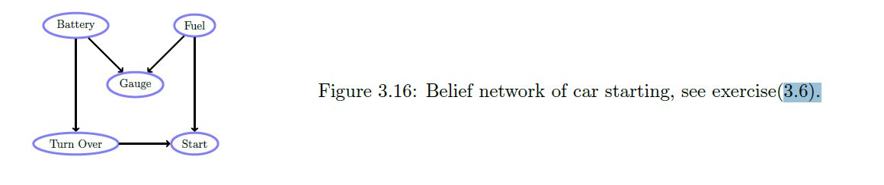
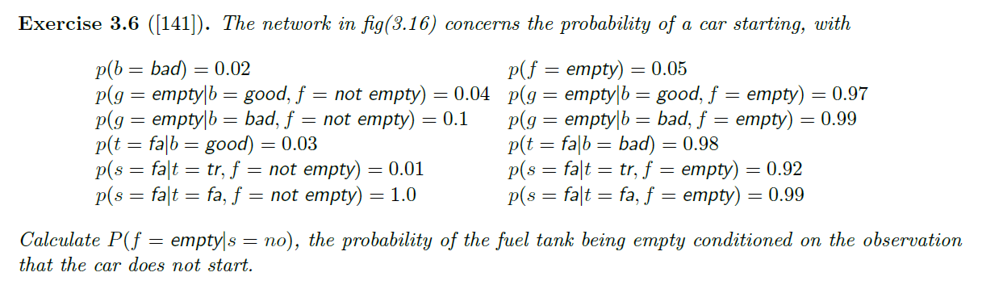

$$ p(B,F,G,T,S) = p(G|B,F)p(T|B)p(S|T,F)p(B)p(F) $$
Now we can compute the value of $p(f = empty | s = no)$ as below:
$$
p(F = empty| S = no) = \frac{p(F = empty, S = no)}{p(S = no)}
$$
$$
p(F = empty| S = no) = \frac{\sum_{B,G,T}p(B, F = empty, G, T, S = no)}{\sum_{B,F,G,T} p(B, F, G, T, S = no)}
$$
$$
p(F = empty| S = no) = \frac{\sum_{B,G,T} p(G|B,F=e) p(T|B)p(S = no|T, F=e) p(B) p(F = e)}{\sum_{B,F,G,T} p(G|B,F)p(T|B)p(S = no|T,F)p(B)p(F)}
$$
Let's first do some variable elimination to make our life easier:
for the numerator, 
$$
numerator = p(F = e)\sum_T p(S = no|T, F = e) \sum_B p(T|B) p(B) \sum_G p(G|B,F=e)
$$
$$
= p(F = e)\sum_T p(S = no|T, F = e) \sum_B p(T|B) p(B)
$$
$$
= p(F = e)\sum_T p(S = no|T, F = e) 
$$

So the final numerator we get is 
$$
p(F = e)\sum_T p(S = no|T, F = e)
$$
For the denominator, we do the same variable elimination as below: 
$$
denominator = \sum_F p(F) \sum_T p(S = no|T,F) \sum_B p(T|B) p(B) \sum_G p(G|B,F)
$$
$$
= \sum_F p(F) \sum_T p(S = no|T,F) \sum_B p(T|B) p(B)
$$
$$
= \sum_F p(F) \sum_T p(S = no|T,F)
$$
So the final denominator we get is 
$$
\sum_F p(F) \sum_T p(S = no|T,F)
$$
And the final expression for $p(f = empty | s = no)$ becomes
$$
\frac{p(F = e)\sum_T p(S = no|T, F = e)}{\sum_F p(F) \sum_T p(S = no|T,F)}
$$
And now we shall plug in the values we know: 
$$
\frac{p(F = e)\sum_T p(S = no|T, F = e)}{\sum_F p(F) \sum_T p(S = no|T,F)} 
$$
$$
= \frac{p(F = e) (p(S = fa| T = tr, F = e) + p(S = fa| T = fa, F = e))}{p(F = e)(p(S = fa|T = tr, F = e) + p(S = fa|T = fa, F = e)) + p(F = ne)(p(S = fa|T = tr, F = ne) + p(S = fa|T = fa, F = ne)) }
$$
$$
 = \frac{0.05*(0.92+0.99)}{0.05*(0.92+0.99) + 0.95*(0.01+1.0)} \approx 0.0905 
$$

